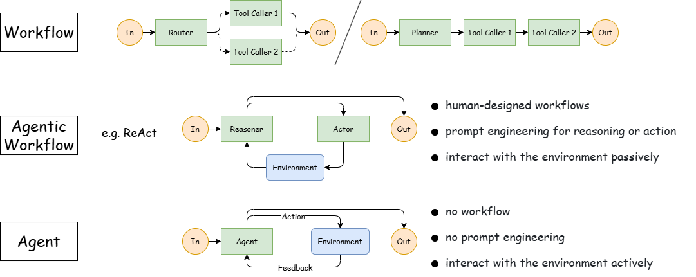
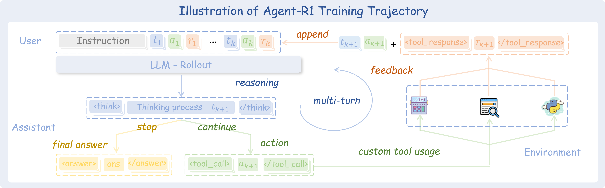
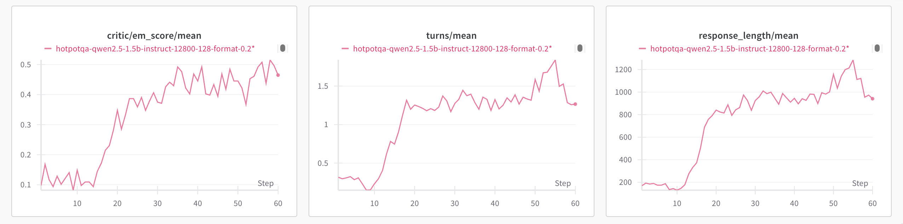
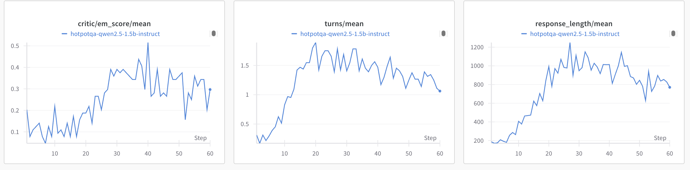
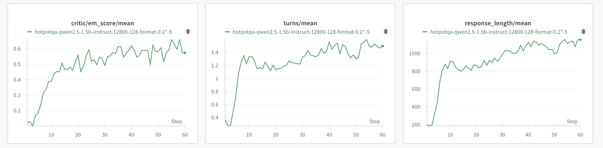

<h1 align="center"> Agent-R1: Training Powerful LLM Agents with End-to-End Reinforcement Learning </h1>

<p align="center"></p>

## News

- [2025.3.18] Added comprehensive **multi-modal support**! Agent-R1 now seamlessly integrates with vision-language models (VLMs), enabling agents to process and reason with both text and visual inputs in rich multi-modal environments.

- [2025.3.18] Refactored our codebase to improve maintainability! We've converted verl from a static folder to a **git submodule** and separated our custom code extensions. This makes it easier to update `verl` and understand the project structure.
  > **Important:** After pulling this update, you'll need to reinitialize your environment. Run `git submodule update --init --recursive` and reinstall verl locally from this directory.

- [2025.3.16] Added support for **process rewards**! You can now assign rewards for each tool call based on its effectiveness. To balance process rewards with outcome rewards, we implemented reward normalization inspired by [PRIME](https://github.com/PRIME-RL/PRIME).
## Overview

**Agent-R1** is an open-source framework designed to accelerate research and development at the critical intersection of **RL** and **Agent**. Our framework employs **End-to-End** reinforcement learning to train agents in specific environments. Developers need only define domain-specific tools and reward functions to extend Agent-R1 to their unique use cases, eliminating the need for complex workflow engineering. We hope our modest contribution can benefit the open-source community, making it easier for researchers and developers to create and explore agents in their own domains, collectively advancing the development of autonomous agents. For more details on the algorithm, see [algorithm doc](https://github.com/0russwest0/Agent-R1/blob/main/docs/algorithm/algorithm.md).

> **Also check out [Awesome-Agent-RL](https://github.com/0russwest0/Awesome-Agent-RL)**: Our curated collection of papers and resources on unlocking the potential of Agents through Reinforcement Learning.

<p align="center"></p>

## Key Features

- **Multi-turn Tool Calling**: End-to-end reinforcement learning on complete interaction trajectories, allowing agents to learn from sequences of actions
- **Multi-tool Coordination**: Train agents to effectively coordinate and use multiple tools together to solve complex tasks
- **Process Rewards**: Assign rewards for each tool call based on its effectiveness, balanced with outcome rewards through normalization
- **Custom Tools and Environments**: Compatible with mainstream LLM tool calling formats, making it easy to extend with your own tools and scenarios
- **Multiple RL Algorithms**: Supports diverse reinforcement learning approaches including `PPO`, `GRPO`, and `REINFORCE++`
- **Multi-modal Support**: Compatible with vision-language models (VLMs) and multi-modal reinforcement learning

## Upcoming Features

- **Expanded Model Support**: Integration with more foundation models beyond the currently supported Qwen
- **Additional Use Cases**: More example implementations across diverse scenarios and domains

## Get Started
- [Environment Setup](https://github.com/0russwest0/Agent-R1/blob/main/docs/getting_started/installation.md)
- [Quick Start: Try Default Search Tool on HotpotQA](https://github.com/0russwest0/Agent-R1/blob/main/docs/getting_started/quickstart.md)


### Results on HotpotQA

#### PPO



#### REINFORCE++



#### GRPO



We can see that the model (Qwen2.5-1.5B-Instruct) effectively learns to think and then invoke the tool in multiple rounds when faced with challenging multi-hop questions, ultimately achieving improved the EM results. The effectiveness of different reinforcement learning algorithms varies, but the general trend is the same.

Notably, our experiments reveal a striking correlation: EM scores, number of tool calls (turns), and final response length all display consistent trends across training. This demonstrates a novel dimension of scaling laws—one that relates to the frequency of agent-environment interactions. As the agent learns to interact more effectively with its environment through multiple tool calls, performance improves proportionally, suggesting that the ability to engage in multiple rounds of environment interaction may be as crucial to agent performance as traditional scaling factors.

## Extending Agent-R1 with Your Own Tools and Environments

**Extending Agent-R1** is straightforward: create **custom tools** by extending the `Tool` base class, implement **data preprocessing** scripts to format your dataset, and define **reward functions** for task-specific evaluation. Register these components in their respective directories, and configure a training script to adapt Agent-R1 to your use case.  

For detailed implementation guidance, examine the existing code:
- Tools: `agent_r1/tool/tools/calculator_tool.py`, `search_tool.py`
- Data processing: `examples/data_preprocess/hotpotqa.py`
- Reward functions: `verl/utils/reward_score/qa_em_and_format.py`

See the [extending doc](https://github.com/0russwest0/Agent-R1/blob/main/docs/extend/extending.md) for details.

## Feedback
We welcome all forms of feedback! Please raise an issue for bugs, questions, or suggestions. This helps our team address common problems efficiently and builds a more productive community.

## Contributors

**Student Contributors**: [**Jie Ouyang**\*](https://github.com/0russwest0), [**Ruiran Yan**\*](https://github.com/RuiranYan), [**Yucong Luo**\*](https://github.com/GodFire66666), Zirui Liu, Shuo Yu, Daoyu Wang

**Supervisors**: [**Qi Liu**](http://staff.ustc.edu.cn/~qiliuql/), [**Mingyue Cheng**](https://mingyue-cheng.github.io/)

**Affiliation**: **State Key Laboratory of Cognitive Intelligence, USTC**

## Acknowledgements  
We extend our gratitude to [DeepSeek](https://github.com/deepseek-ai/DeepSeek-R1) for providing the DeepSeek-R1 model and inspiring ideas. We are also thankful to the [veRL](https://github.com/volcengine/verl) team for their robust infrastructure support. Additionally, we acknowledge the [RAGEN](https://github.com/ZihanWang314/ragen) team for their groundbreaking discoveries, which significantly influenced our early exploration. Lastly, we deeply appreciate the insightful discussions and contributions from Jie Ouyang, Ruiran Yan, Yucong Luo, Zirui Liu, Shuo Yu and Daoyu Wang.

## Citation
**Agent-R1**
```md
@misc{Agent-R1,
  author       = {Jie Ouyang, Ruiran Yan, Yucong Luo, Mingyue Cheng, Qi Liu, Zirui Liu, Shuo Yu, Daoyu Wang},
  title        = {Training Powerful LLM Agents with End-to-End Reinforcement Learning},
  year         = {2025},
  organization = {GitHub},
  url          = {https://github.com/0russwest0/Agent-R1},
}
```

## Star History

[](https://www.star-history.com/#0russwest0/Agent-R1&Date)
