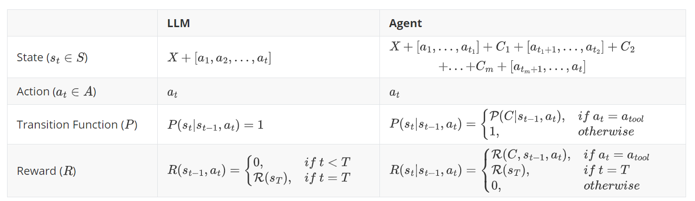

## Algorithm

Reinforcement learning for Agents differs significantly from LLM (Chatbots, Reasoners). The key distinction lies in the fact that: **a complete Agent trajectory typically involves multi-turn interaction**, requiring **multiple tool calls** to solve user queries. Below, we formalize this distinction using the Markov Decision Process (MDP) framework. 

In the contect of LLM:
- **State**: Simply the sequence of the input prompt and all generated text so far
- **Action**: Selecting the next token from the vocabulary to add to the sequence
- **Transitions**: Straightforward addition of the selected token to the existing sequence
- **Rewards**: Typically only provided at the end of the sequence generation

For Agent, the components are more complex:
- **State**: Includes not only the input and generated text, but also all tool responses from previous interactions
- **Action**: Still involves selecting the next token, but some tokens can trigger tool calls
- **Transitions**: 
  - Regular tokens: Simply add to the sequence like in traditional LLM training
  - Tool-triggering tokens: Cause external tool execution that produces responses, **introducing significant stochasticity** into state transitions unlike the deterministic nature of standard LLM generation
- **Rewards**: Can be provided at multiple points:
  - After each tool call, which **naturally creates process-level rewards** based on the quality and effectiveness of tool usage
  - At the end of the complete interaction based on overall task completion

In order to better understand the difference between **Agent** and context of **LLM**, we provide formal definitions for both methods separately:

where:

- $X$ is the sequence of the current prompt
- $C_j$ is the result of the $j$-th tool call and $m$ is the number of tool calls
- $a_t$ is the token selected from the vocabulary
- $t_j$ is the number of token responses between the $j-1$th and $j$-th tool calls, $0<t_1+t_2+...+t_m<t$

This richer reinforcement learning framework allows Agent-R1 to train LLMs that learn effective strategies for when and how to use tools across multi-turn interactions. By optimizing over entire trajectories rather than single responses, we can apply algorithms like PPO, REINFORCE++, and GRPO to develop agents that reason effectively before taking actions.

